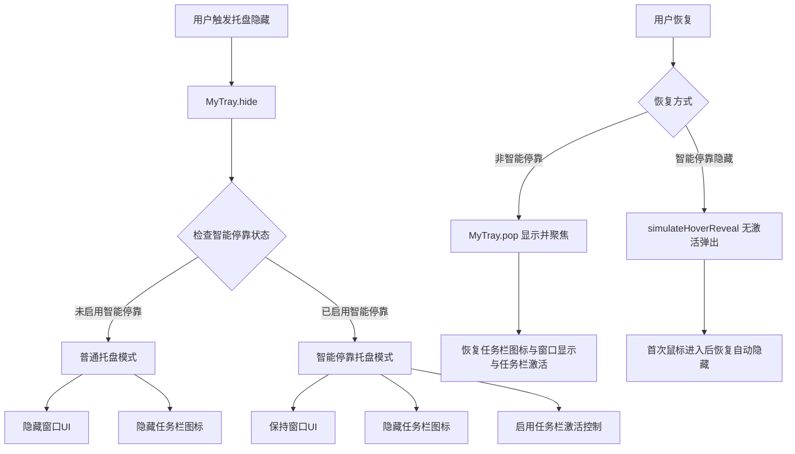

# 智能托盘隐藏功能 - 技术文档

## 🏗️ 架构概览

智能托盘隐藏功能通过集成托盘系统（MyTray）和智能停靠系统（SmartDock）实现，提供根据窗口状态智能决策的托盘隐藏行为。



## ⚙️ 核心实现

### 1. 智能状态检测

```dart
/// 检查是否处于智能停靠模式
bool _isInSmartDockMode() {
  try {
    return SmartDockManager.isSmartDockingEnabled() &&
           MouseTracker.state != MouseTrackingState.disabled;
  } catch (e) {
    if (kDebugMode) {
      print('MyTray: 检查智能停靠状态失败: $e');
    }
    return false;
  }
}
```

**检测逻辑**：
- `SmartDockManager.isSmartDockingEnabled()`：智能停靠功能是否启用
- `MouseTracker.state != MouseTrackingState.disabled`：是否有活跃的鼠标跟踪

### 2. 智能托盘隐藏逻辑

```dart
Future<void> hide() async {
  try {
    // 设置托盘模式状态
    isTrayMode.value = true;

    // 隐藏任务栏图标
    await windowManager.setSkipTaskbar(true);

    // 根据智能停靠状态决定是否隐藏窗口UI
    if (!_isInSmartDockMode()) {
      // 普通模式：隐藏窗口UI
      await windowManager.hide();
      isVisible.value = false;
    } else {
      // 智能模式：保持窗口UI，启用任务栏激活控制，并强制收起到隐藏位
      await NativeWindowHelper.setNoActivateTaskbar(true);
      await MouseTracker.forceCollapseToHidden(); // 强制收起但保留悬停唤醒
    }
  } catch (e) {
    // 错误处理
  }
}
```

### 3. 任务栏激活控制

```dart
/// 设置窗口为不激活任务栏模式
static Future<bool> setNoActivateTaskbar(bool enable) async {
  // Windows API常量
  const int GWL_EXSTYLE = -20;
  const int WS_EX_NOACTIVATE = 0x08000000;

  // 获取当前扩展样式
  final currentExStyle = getWindowLongPtr(hwnd.address, GWL_EXSTYLE);

  int newExStyle;
  if (enable) {
    // 添加 WS_EX_NOACTIVATE 样式
    newExStyle = currentExStyle | WS_EX_NOACTIVATE;
  } else {
    // 移除 WS_EX_NOACTIVATE 样式
    newExStyle = currentExStyle & ~WS_EX_NOACTIVATE;
  }

  final result = setWindowLongPtr(hwnd.address, GWL_EXSTYLE, newExStyle);
  return result != 0;
}
```

**技术原理**：
- `WS_EX_NOACTIVATE`：Windows扩展样式，防止窗口激活时激活任务栏
- 只在智能停靠托盘模式下启用
- 退出托盘模式时自动恢复

### 4. 焦点管理增强

```dart
static void _restoreNormalStateOnFocus() async {
  try {
    // 检查是否处于托盘模式
    if (MyTray.to.isTrayMode.value) {
      // 处于托盘模式，不恢复任务栏显示
      if (MouseTracker.state != MouseTrackingState.disabled) {
        await windowManager.setAlwaysOnTop(false);
        debugPrint('智能停靠：窗口获得焦点，但处于托盘模式，保持任务栏隐藏');
      }
      return;
    }

    // 正常的焦点恢复逻辑...
  } catch (e) {
    debugPrint('智能停靠：恢复正常状态时出错：$e');
  }
}
```

## 🔧 集成方式

### 1. 基础集成

```dart
// 在 main.dart 中配置
await MyApp.initialize(
  // 启用智能停靠
  // （智能托盘功能依赖智能停靠状态检测）

  // 配置托盘
  tray: MyTray(
    tooltip: "我的应用",
    menuItems: [
      MyTrayMenuItem(
        label: '恢复显示',
        onTap: () => MyTray.to.pop(),
      ),
    ],
  ),
);
```

### 2. 启用智能停靠

```dart
// 在应用启动后启用智能停靠
await SmartDockManager.setSmartEdgeDocking(
  enabled: true,
  visibleWidth: 5.0,
);
```

### 3. 使用智能托盘隐藏

```dart
class MyController extends GetxController {
  void intelligentHideToTray() {
    final tray = MyTray.to;

    // 智能隐藏（自动检测模式）
    tray.hide();

    // 可选：显示状态通知
    final isSmartMode = tray.isTrayMode.value &&
                       SmartDockManager.isSmartDockingEnabled();

    if (isSmartMode) {
      MyNotify.to.show("智能托盘模式", "鼠标移动到边缘可激活窗口");
    } else {
      MyNotify.to.show("已隐藏到托盘", "点击托盘图标可恢复窗口");
    }
  }
}
```

## 🔍 状态管理

### 关键状态变量与过渡标记

```dart
class MyTray extends GetxService {
  // 托盘模式状态
  final isTrayMode = false.obs;

  // 窗口可见性状态
  final isVisible = true.obs;
}

class SmartDockManager {
  // 智能停靠启用状态
  static bool _isSmartDockingEnabled = false;
}

class MouseTracker {
  // 鼠标跟踪状态
  static MouseTrackingState _state = MouseTrackingState.disabled;

  // 托盘触发后的过渡标记：
  // - simulateHoverReveal() 置为 true，阻止“未进入就隐藏”
  // - 检测到首次进入窗口后置为 false，恢复自动隐藏
  static bool _awaitingFirstEnterAfterReveal = false;
}
```

### 状态同步机制

1. **托盘模式状态**：`MyTray.isTrayMode`
2. **智能停靠状态**：`SmartDockManager.isSmartDockingEnabled()`
3. **鼠标跟踪状态**：`MouseTracker.state`
4. **窗口可见性**：`MyTray.isVisible`

## 🐛 调试和故障排除

### 调试日志

```dart
// 启用调试模式查看详细日志
if (kDebugMode) {
  print('MyTray: 已进入托盘模式（智能停靠状态，任务栏激活控制：成功）');
  print('智能停靠：窗口获得焦点，但处于托盘模式，保持任务栏隐藏');
  print('原生窗口助手：成功设置不激活任务栏模式：true');
}
```

### 常见问题

1. **智能模式未触发**
   ```dart
   // 检查智能停靠状态
   debugPrint('SmartDock enabled: ${SmartDockManager.isSmartDockingEnabled()}');
   debugPrint('Mouse tracking: ${MouseTracker.state}');
   ```

2. **任务栏激活控制失效**
   ```dart
   // 检查Windows API调用结果
   final result = await NativeWindowHelper.setNoActivateTaskbar(true);
   debugPrint('NoActivate result: $result');
   ```

3. **状态不同步**
   ```dart
   // 检查各组件状态
   debugPrint('Tray mode: ${MyTray.to.isTrayMode.value}');
   debugPrint('Window visible: ${MyTray.to.isVisible.value}');
   ```

## 🔒 平台兼容性

### Windows平台
- ✅ 完整功能支持
- ✅ 任务栏激活控制
- ✅ 原生Windows API集成

### macOS/Linux平台
- ✅ 基础智能托盘功能
- ❌ 任务栏激活控制（自动跳过）
- ✅ 智能停靠集成

### 平台检测代码
```dart
static Future<bool> setNoActivateTaskbar(bool enable) async {
  if (!Platform.isWindows || !_initialized || _user32 == null) {
    debugPrint('原生窗口助手：非Windows平台或未初始化，跳过任务栏激活控制');
    return true;
  }
  // Windows特定实现...
}
```

## 📊 性能考虑

### 状态检测优化
- 状态检测调用频率控制
- 异常处理避免性能影响
- 缓存机制减少重复计算

### 内存管理
- 及时清理事件监听器
- 状态变量的合理生命周期
- 避免内存泄漏

## 🔗 相关组件

- **MyTray**：托盘管理器
- **SmartDockManager**：智能停靠管理器
- **MouseTracker**：鼠标跟踪器
- **WindowFocusManager**：窗口焦点管理器
- **NativeWindowHelper**：原生窗口API封装

---

*最后更新：2025-08-01*
