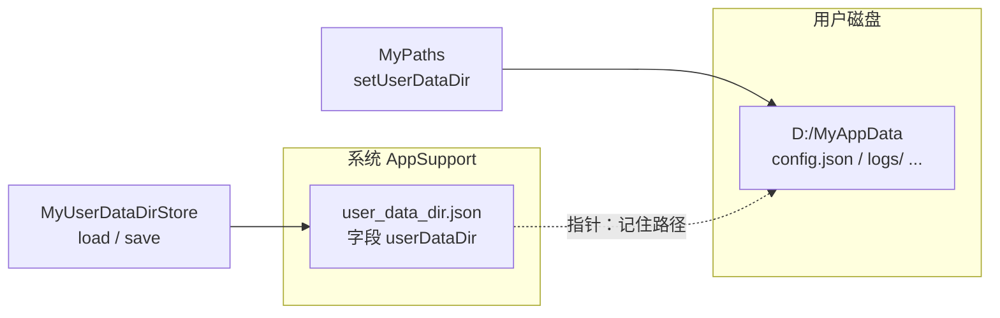
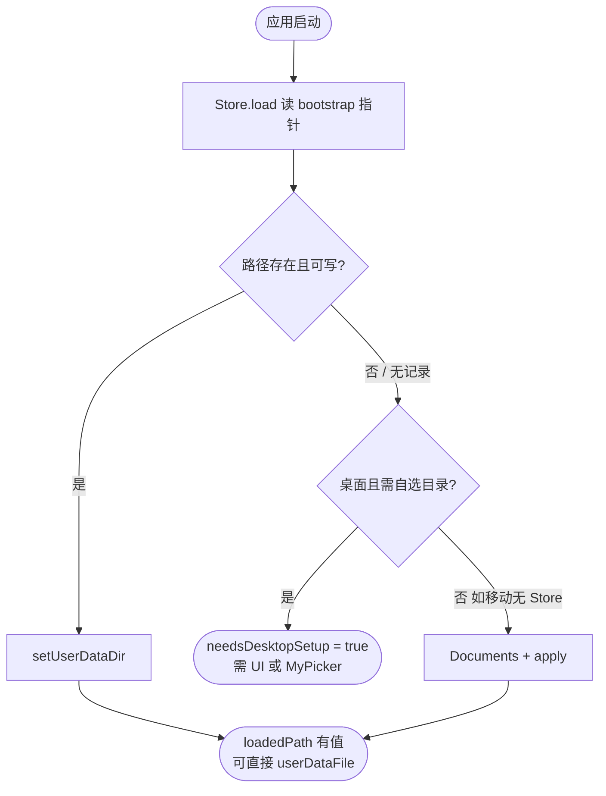

# 安装目录与用户数据目录（MyPaths）

> 命名约定摘要见 [`AGENTS.md` §4.2](../AGENTS.md#42-路径mypaths--install--userdata)。本文是路径 API 的**完整说明**。  
> **启动编排 + 系统选目录**（流程图、何时用哪套 API）见 [`.doc/user_data_picker.md`](user_data_picker.md)。

## 解决什么问题？

桌面应用常有两类文件，**不应混在同一目录**：

| 类型 | 典型内容 | xly 轨 |
|------|----------|--------|
| 随程序安装 | `tray.ico`、内置 exe | **install**（`installDir` / `installFile`） |
| 用户业务数据 | 配置、日志、数据库 | **userData**（`userDataDir` / `userDataFile`） |

用户可能把数据放在 `D:\AppData`，程序在 `C:\Program Files\...`。库要帮你解决：

1. **首次**：让用户选定数据目录并**记住**；
2. **以后启动**：自动恢复，不必每次再问。

`MyPaths` 只负责：**根目录已定**之后怎么读写文件。  
「根从哪来、怎么持久化、要不要弹系统选夹」→ `MyUserDataDirStore` + `MyUserDataDirSession` +（可选）[`.doc/user_data_picker.md`](user_data_picker.md) 里的 `MyPicker`。

## 两层目录（Bootstrap 指针 vs 真实数据）



- **Bootstrap JSON**：小文件，只存「用户数据根在哪」；默认在 `getApplicationSupportDirectory()` 下。
- **真实数据目录**：用户选的（或移动端 Documents）；`userDataFile('config.json')` 都相对这里。

## 命名：Dir 与 File

| 后缀 | 返回 | 含义 |
|------|------|------|
| `Dir` | `String`（目录路径） | 文件夹根或子目录（如 `userDataLogsDir`） |
| `File` | `Future<File>` | `dart:io` 文件；参数为**相对路径** |
| `…To…Dir` | `Future<File>` | 如 `copyAssetToInstallDir`：`Dir` 表示落到哪条轨，返回值仍是文件 |

需要文件路径字符串：`(await MyPaths.userDataFile('a.json')).path`。

**不提供** `*FilePath()` 公开方法。Web 目标请 `import 'package:xly/paths.dart'`：自动选用 `MyPaths` 桩实现（全部 API 抛 `UnsupportedError`）；`MyUserDataDirStore` 等仍依赖 `dart:io`，Web 勿 import。

## 两条轨

| 轨 | API 前缀 | 用途 |
|----|----------|------|
| **install** | `installDir` / `installFile` / `copyAssetToInstallDir` | exe 旁资源、托盘图标、从 assets 落到安装侧 |
| **userData** | `setUserDataDir` / `userDataDir` / `userDataFile` / … | 配置、日志、业务 JSON |

- **便携应用**：只用 `install*`。
- **桌面、数据与 exe 分离**：`setUserDataDir` + `userData*`；可选 `MyUserDataDirStore` 记住目录（Bootstrap 指针，在 AppSupport 下 JSON）。

### `installDir` 跨平台

- **桌面**：exe 所在目录（同步）。
- **移动**：Documents 作可写资源 fallback（无 exe 旁「安装目录」语义，行为等同旧 `getAppDirectory` 移动侧）。
- **Web**：`UnsupportedError`。

## 公开 API（MyPaths）

| API | 返回 | 说明 |
|-----|------|------|
| `installDir` | `String` | install 轨根目录 |
| `installFile(relativePath, {androidPreferExternal})` | `Future<File>` | install 轨下文件 |
| `setUserDataDir(path, {clearCache})` | `void` | 设置 userData 根 |
| `userDataDir` | `String` | 已设置的根；未设置抛 `StateError` |
| `isUserDataDirSet` | `bool` | 是否已设置 |
| `userDataFile(relativePath)` | `Future<File>` | userData 轨下文件 |
| `userDataLogsDir()` | `Future<String>` | `logs/` 子目录 |
| `copyAssetToInstallDir` / `copyAssetToUserDataDir` | `Future<File>` | 从 `assets/` 复制（目标不存在时写入） |
| `atomicWriteString(file, content)` | `Future<void>` | 原子写 |

`relativePath`：可为 `'config.json'` 或 `'logs/app.log'`；禁止 `..` 与绝对路径。

## 关联类型（paths 子入口）

| 类型 | 职责 |
|------|------|
| `MyUserDataDirStore` | Bootstrap 指针：AppSupport 下 JSON，**仅**在应用调用 `save` 时写入 |
| `MyUserDataDirValidator` | 目录存在/可写评估与风险提示（无 UI） |
| `MyUserDataDirSession` | `prepare` / `apply` 启动编排（`BootstrapResult` 含 `storedPath` / `storedEvaluation`；`apply` 可选 `onAfterApply`） |

默认 bootstrap：`user_data_dir.json`、字段 `userDataDir`（构造参数可覆盖）。

## `Session.prepare` 在启动时做什么？



`prepare` **不会**弹出系统选夹；它只告诉你：**内存里的 userData 根是否已经定好**。定不好时，再用 [picker 文档](user_data_picker.md) 里的 `MyPicker.dir` / 自研设置页 + `Session.apply`。

## 何时需要哪套能力？

| 你的应用 | 需要 Store / Session / Picker？ |
|----------|--------------------------------|
| 便携版，数据跟 exe 走 | **否**，只用 `install*` |
| 桌面，数据与 exe 分离，要记住用户选择 | **是**，推荐 `prepare` + 必要时 `MyPicker` |
| 移动，固定 Documents 即可 | 可用 `prepare`（无 Store 时自动 `apply` Documents），或自行 `setUserDataDir` |
| Web | 路径 API 不可用（`UnsupportedError`） |

| 时刻 | 用什么 | 解决什么 |
|------|--------|----------|
| **每次启动** | `MyUserDataDirSession.prepare` | 自动恢复 userData 根；返回是否要再选目录 |
| **首次 / Store 失效** | `prepare` 之后 → `MyPicker.dir` 或自研 Dialog → `apply` | 用户选定目录并写入 bootstrap |
| **菜单「更改数据目录」** | `MyPicker.userDataDirAndApply` | 系统选夹 + 校验 + 写 Store（见 picker 文档） |
| **设置页手输路径** | `Session.apply` | 已有字符串，不弹 OS 对话框 |
| **根已设，日常读写** | `MyPaths.userDataFile` 等 | 与 Store/Session 无关 |

## 日常用法

**推荐**（启动编排；未配置时见 [picker 文档](user_data_picker.md) 补选目录）：

```dart
final store = MyUserDataDirStore.defaultInstance;
final boot = await MyUserDataDirSession.prepare(store: store);

if (boot.needsDesktopSetup) {
  // MyPicker.dir() 或自研设置对话框 → Session.apply(...)
} else {
  final ico = await MyPaths.installFile('tray.ico');
  final config = await MyPaths.userDataFile('config.json');
}
```

**进阶 · 手动三步**（完全自己控制顺序时再用；`Store.load()` 返回 `String?`，即 bootstrap JSON 里保存的用户数据目录路径，无记录为 `null`）：

```dart
final ico = await MyPaths.installFile('tray.ico');

final saved = await store.load();
MyPaths.setUserDataDir(saved ?? userPickedDir);

final config = await MyPaths.userDataFile('config.json');
```

## 自定义 Bootstrap 文件名

```dart
const MyUserDataDirStore(
  bootstrapFileName: 'my_app_data_pointer.json',
  jsonPathKey: 'dataRoot',
);
```

端到端流程与代码示例见 [`.doc/user_data_picker.md`](user_data_picker.md#端到端流程)。

## 测试

```bash
flutter test test/my_paths_test.dart
```
