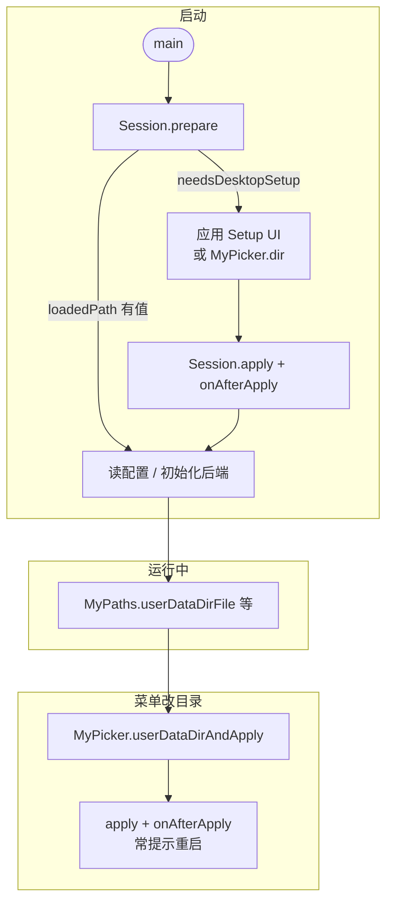
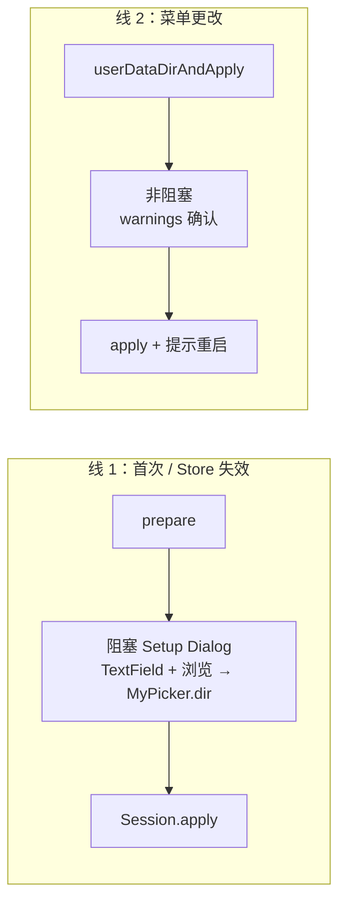

# 系统文件/夹选择（MyPicker）与 userData 启动

> 路径双轨与 `MyPaths` 见 [`.doc/user_data_paths.md`](user_data_paths.md)。本文说明 **`MyPicker`**、**`MyUserDataDirSession`** 及与 **`MySelector`** 的边界。

## 解决什么问题？

| 能力 | 回答的问题 |
|------|------------|
| **`MyUserDataDirSession.prepare`** | 启动时：**能否自动恢复**上次的数据目录？若不能，是否要用户再选？ |
| **`MyPicker.dir` / `userDataDirAndApply`** | 需要 **OS 系统对话框** 选文件夹时，谁去调 `file_selector`？ |
| **`Session.apply`** | 路径**已经确定**（选完或手输），如何 **校验 + 写入 bootstrap + setUserDataDir**？ |
| **`MyPaths.userDataDirFile`** | 根**已定**之后，如何读写 `config.json` 等（与选目录无关） |

记忆：**prepare = 启动编排；Picker = 弹出选夹的那一下；apply = 把选定路径落盘。**

## 端到端流程 {#端到端流程}

桌面应用（数据与 exe 分离）典型生命周期：



**两条 UX 线**（库不提供对话框，由应用实现）：



## 我该用哪个 API？（速查）

| 场景 | API | 不要误用 |
|------|-----|----------|
| 应用启动 | `Session.prepare` | 不要用 `Store.load` 代替整套启动判断 |
| 系统选单个目录 | `MyPicker.dir` | 不是 `MyPaths.userDataDir`（那是 getter） |
| 系统选文件 / 多文件 | `MyPicker.file` / `files` | 不是 `MySelector`（应用内列表） |
| 选目录并保存为 userData 根 | `MyPicker.userDataDirAndApply` | 菜单改目录首选 |
| 手输路径后保存 | `Session.apply` | 不必先 `Picker` |
| 读写业务文件 | `MyPaths.userDataDirFile` | 须先 `setUserDataDir`（通常由 prepare/apply 完成） |

**何时可以不要 Picker / Session？** 便携应用（只用 app 轨）、或你自己完全接管路径逻辑时。见 [paths 文档 · 何时需要哪套能力](user_data_paths.md#何时需要哪套能力)。

## 三者对照

| | `MyPicker` | `MySelector` | `MyPaths` |
|---|------------|--------------|-----------|
| 入口 | `package:xly/picker.dart` | `package:xly/selector.dart` | `package:xly/paths.dart` 或 `xly.dart` |
| 作用 | OS 文件/夹对话框 | 应用内浮层列表 | 已知根的路径 IO |
| 典型调用 | `await MyPicker.dir()` | `await MySelector.show(...)` | `MyPaths.userDataDirFile('a.json')` |

**注意**：`MyPicker.dir()` 是**弹出系统选夹**。未传 `initialDir` 且已 `setUserDataDir` 时，对话框会默认打开当前 `MyPaths.userDataDir`（见 `MyPicker.resolveInitialDir`）。

## MyPicker API

类名已表达「选择」；方法 **`dir` / `file` / `files`**（省略 `pick` 前缀）。

| 方法 | 返回 | 说明 |
|------|------|------|
| `dir({initialDir, confirmButtonText})` | `Future<String?>` | 选一个目录；取消 `null` |
| `file({initialDir, acceptedExtensions, ...})` | `Future<String?>` | 选一个文件 |
| `files({...})` | `Future<List<String>>` | 多选；取消或未选 `[]` |
| `userDataDirAndApply({store, confirmWarnings, onAfterApply, ...})` | `Future<String?>` | `dir` → 校验 → 可选 warnings → `Session.apply` |
| `resolveInitialDir(initialDir)` | `String?` | 显式目录优先，否则回退 `userDataDir` |

Web：`MyPicker` 全部抛 `UnsupportedError`（与 `paths` Web 桩策略一致）。

## MyUserDataDirSession

由 `paths.dart` 导出，**不**依赖 `file_selector`。

| 方法 | 说明 |
|------|------|
| `prepare({store})` | 有效 Store → `setUserDataDir`；移动无 Store → Documents + `apply`；桌面无/无效 Store → `needsDesktopSetup: true` |
| `apply({userDataDir, store, onAfterApply, ...})` | 校验 → `store.save` → `setUserDataDir` → 可选 `onAfterApply` |

### `MyUserDataDirBootstrapResult`

| 字段 | 含义 |
|------|------|
| `needsDesktopSetup` | 需在应用 UI 中选/确认目录 |
| `loadedPath` | `prepare` 已成功 `setUserDataDir` 的路径 |
| `storedPath` | `store.load()` 原始值（不论是否有效） |
| `storedEvaluation` | 对 `storedPath` 的 `evaluate` 结果 |
| `hasInvalidStoredPath` | Store 有记录但目录不可用 |

`hasInvalidStoredPath == true` 时，Setup UI 可显示「上次目录失效」类文案（`storedEvaluation?.hint`），与「首次安装」区分。

### `onAfterApply`（应用副作用）

库在 `apply` 完成 Store + `setUserDataDir` 后调用。用于：

- 通知 Rust / 原生层数据根变更
- 重置应用内路径缓存（如 `Assets` 单例）
- 提示用户重启（文案由应用决定）

**库不负责**上述具体实现；避免在 `main`、Setup、菜单三处重复手写同步逻辑。

## 推荐集成（代码）

```dart
import 'package:xly/paths.dart';
import 'package:xly/picker.dart';

final store = MyUserDataDirStore.defaultInstance;
final boot = await MyUserDataDirSession.prepare(store: store);
if (boot.needsDesktopSetup) {
  final path = await myApp.showUserDataDirSetupDialog(
    context,
    initialPath: boot.storedPath,
    invalidHint: boot.storedEvaluation?.hint,
  );
  await MyUserDataDirSession.apply(
    userDataDir: path,
    store: store,
    onAfterApply: myApp.afterUserDataDirChanged,
  );
} else if (boot.loadedPath != null) {
  await myBackend.configureDataDirectory(boot.loadedPath!);
}

// 菜单改目录：
await MyPicker.userDataDirAndApply(
  store: store,
  confirmWarnings: (w) => myApp.confirmWarnings(context, w),
  onAfterApply: (p) async {
    await myBackend.configureDataDirectory(p);
    myAssets.resetCachedPaths();
    myApp.toastRestartRequired();
  },
);
```

库内**不提供**阻塞式设置对话框；`example` 仅演示路径 API。

## 测试

```bash
flutter test test/my_paths_test.dart
```
