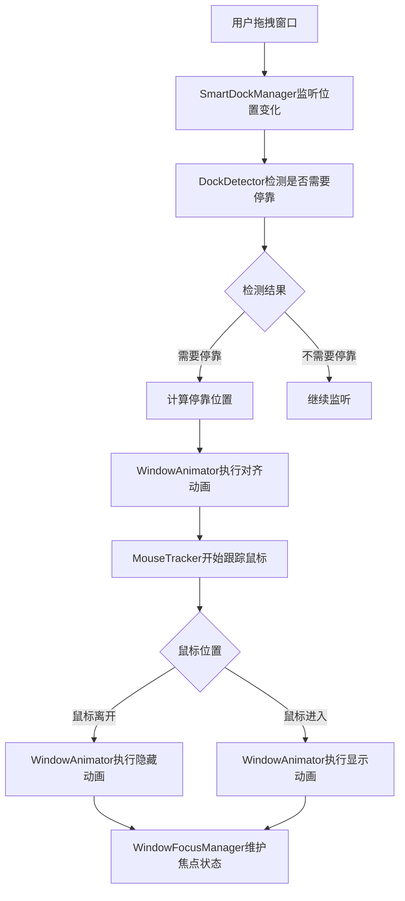

# 智能停靠模块 (Smart Dock Module)

这个模块提供了完整的窗口智能停靠功能，包括边缘停靠和角落停靠。

## 📁 文件结构

```
lib/src/smart_dock/
├── smart_dock.dart              # 🚪 公开接口入口文件
├── smart_dock_manager.dart      # 🎯 主协调器
├── window_animator.dart         # 🎬 动画控制器
├── dock_detector.dart           # 🔍 停靠检测器
├── mouse_tracker.dart           # 🖱️ 鼠标跟踪器
├── window_focus_manager.dart    # 👁️ 窗口焦点管理器
└── README.md                    # 📖 本文档
```

## 🏗️ 架构设计

### 核心组件

#### 1. **SmartDockManager** - 主协调器
- **职责**：作为各组件的协调器，提供统一的公开API
- **特点**：轻量级，主要负责组件间的协调和配置管理
- **公开方法**：
  - `setSmartEdgeDocking()` - 启用/禁用智能停靠
  - `isSmartDockingEnabled()` - 获取启用状态
  - `stopAll()` - 停止所有功能

#### 2. **WindowAnimator** - 动画控制器
- **职责**：处理所有窗口位置的平滑动画
- **特点**：
  - 基于Ticker的高精度动画
  - 预定义动画配置
  - 防重复执行和资源泄漏
- **预设配置**：
  - `alignTo()` - 对齐动画（120ms, easeOutQuart）
  - `hideTo()` - 隐藏动画（100ms, easeInQuart）
  - `showTo()` - 显示动画（80ms, easeOutQuart）

#### 3. **DockDetector** - 停靠检测器
- **职责**：检测窗口是否应该停靠，计算停靠位置
- **特点**：
  - 智能区分边缘和角落停靠
  - 可配置的检测阈值
  - 精确的位置计算
- **检测逻辑**：
  - 边缘停靠：单方向溢出 > 5px
  - 角落停靠：双方向溢出 > 5px 且总溢出 > 15px

#### 4. **MouseTracker** - 鼠标跟踪器
- **职责**：监听鼠标位置，控制窗口显示/隐藏
- **特点**：
  - 支持边缘和角落两种跟踪模式
  - 自动检测窗口位置偏移
  - 与动画系统无缝集成
- **跟踪状态**：
  - `disabled` - 未启用
  - `edgeTracking` - 边缘跟踪
  - `cornerTracking` - 角落跟踪

#### 5. **WindowFocusManager** - 窗口焦点管理器
- **职责**：处理窗口焦点变化，维护停靠状态
- **特点**：
  - 独立的焦点监听
  - Windows系统功能管理
  - 失焦状态维护

## 🔄 工作流程



## 🔌 依赖关系

### 与 MyTray 的关系

SmartDock 与 MyTray（系统托盘）功能**完全解耦**，可以独立使用：

- ✅ **仅使用 SmartDock**（不需要 MyTray）- 完全正常工作
- ✅ **仅使用 MyTray**（不需要 SmartDock）- 完全正常工作
- ✅ **同时使用两者** - 自动协调窗口状态（如任务栏图标显示）

**技术实现**：
- 使用 `Get.isRegistered<MyTray>()` 检查 MyTray 是否已注册
- 如果 MyTray 存在，SmartDock 会考虑托盘模式状态（避免任务栏图标冲突）
- 如果 MyTray 不存在，SmartDock 使用默认行为

## 🎯 使用示例

### 基本使用

```dart
import 'package:xly/xly.dart';

// 启用智能停靠（无需 MyTray）
await SmartDockManager.setSmartEdgeDocking(
  enabled: true,
  visibleWidth: 5.0, // 隐藏时可见宽度
);

// 检查状态
bool isEnabled = SmartDockManager.isSmartDockingEnabled();

// 禁用功能
await SmartDockManager.setSmartEdgeDocking(enabled: false);

// 完全停止
await SmartDockManager.stopAll();
```

### 高级配置

```dart
// 自定义可见宽度
await SmartDockManager.setSmartEdgeDocking(
  enabled: true,
  visibleWidth: 10.0, // 更宽的可见区域
);
```

## 🔧 配置参数

| 参数 | 类型 | 默认值 | 说明 |
|------|------|--------|------|
| `enabled` | `bool` | - | 是否启用智能停靠 |
| `visibleWidth` | `double` | `5.0` | 停靠时可见的宽度（像素） |

## 🎨 动画配置

| 动画类型 | 时长 | 曲线 | 用途 |
|----------|------|------|------|
| 对齐动画 | 120ms | easeOutQuart | 窗口对齐到边缘/角落 |
| 隐藏动画 | 100ms | easeInQuart | 鼠标离开时隐藏窗口 |
| 显示动画 | 80ms | easeOutQuart | 鼠标悬停时显示窗口 |

## 🔍 检测阈值

| 检测类型 | 阈值 | 说明 |
|----------|------|------|
| 边缘溢出 | 5px | 单方向超出屏幕边界的最小距离 |
| 角落溢出 | 5px | 每个方向超出屏幕边界的最小距离 |
| 角落总溢出 | 15px | 两个方向溢出距离之和的最小值 |

## 🔧 防止窗口激活机制

为了解决智能停靠时任务栏闪烁的问题，实现了多层防激活机制：

### 核心原理
智能停靠需要窗口保持置顶状态以显示在其他应用之上，但传统的 `setAlwaysOnTop()` 会触发窗口激活事件，导致任务栏闪烁。

### 解决方案层次

#### 1. 原生Windows API方案（首选）
- 使用 `NativeWindowHelper` 直接调用Windows API
- `SetWindowPos` 配合 `SWP_NOACTIVATE` 标志实现置顶但不激活
- `ShowWindow` 配合 `SW_SHOWNOACTIVATE` 标志实现显示但不激活

#### 2. Flutter标准方案（回退）
- 使用 `windowManager.show(inactive: true)` 防止窗口激活
- 添加延迟减少激活事件的影响
- 检查窗口状态避免重复操作

### 关键组件
- `NativeWindowHelper` - 原生Windows API封装
- `WindowAnimationPresets.showToInactive()` - 无激活显示动画
- `WindowAnimationPresets.smartShowTo()` - 智能选择显示方式
- `WindowFocusManager.shouldAvoidActivation` - 检查是否应避免激活

### 技术细节
```cpp
// Windows API调用示例
SetWindowPos(hwnd, HWND_TOPMOST, 0, 0, 0, 0,
    SWP_NOMOVE | SWP_NOSIZE | SWP_NOACTIVATE | SWP_SHOWWINDOW);
```

### 使用场景
- 其他应用激活时，智能停靠窗口保持隐藏状态不闪烁
- 鼠标悬停显示时不会抢夺其他应用的焦点
- 保持智能停靠的真正"后台"特性

## 🎯 任务栏冲突解决方案

### 问题描述
1. **点击任务栏后窗口显示在任务栏上方**：破坏了系统UI层次
2. **垂直任务栏的鼠标悬停闪烁**：鼠标在任务栏上触发应用显示/隐藏循环

### 解决方案：分层Z-order管理
```
任务栏 (系统最顶层)
↓
智能停靠应用 (中间层)
↓
其他应用窗口 (底层)
```

### 核心方法
- `NativeWindowHelper.setBelowTaskbarButAboveOthers()` - 设置窗口在任务栏下方但在其他应用上方
- 使用 `HWND_TOPMOST` 但让系统任务栏自然覆盖
- 避免鼠标在任务栏区域触发应用的显示逻辑

### 技术实现
```cpp
// 设置窗口为TOPMOST，但任务栏仍会覆盖它
SetWindowPos(hwnd, HWND_TOPMOST, 0, 0, 0, 0,
    SWP_NOMOVE | SWP_NOSIZE | SWP_NOACTIVATE | SWP_SHOWWINDOW);
```

这样既保证了智能停靠应用能显示在其他应用上方，又不会与任务栏产生冲突。

## 🚀 扩展指南

### 添加新的动画类型

1. 在 `WindowAnimationPresets` 中添加新的预设
2. 在相应的组件中调用新的动画方法

### 添加新的检测逻辑

1. 在 `DockDetector` 中扩展检测方法
2. 在 `SmartDockManager` 中处理新的检测结果

### 添加新的跟踪模式

1. 在 `MouseTrackingState` 枚举中添加新状态
2. 在 `MouseTracker` 中实现新的跟踪逻辑

## 📝 注意事项

1. **平台支持**：目前仅支持桌面平台（Windows、macOS、Linux）
2. **权限要求**：需要窗口管理权限
3. **性能考虑**：使用了高精度定时器，在低性能设备上可能需要调整检查频率
4. **系统兼容性**：在Windows上会临时禁用系统的自动最大化功能

## 🐛 故障排除

### 常见问题

1. **动画不流畅**：检查系统性能，考虑调整动画时长
2. **检测不准确**：调整检测阈值参数
3. **焦点问题**：确保应用有足够的窗口管理权限

### 调试技巧

1. 查看控制台日志，所有关键操作都有详细日志
2. 使用 `SmartDockManager.isSmartDockingEnabled()` 检查状态
3. 在开发模式下可以看到详细的检测和动画日志
